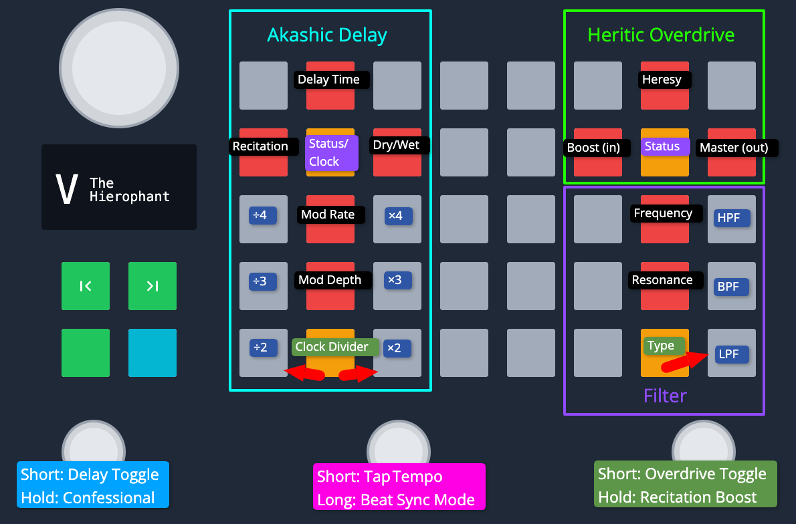

# The Hierophant — The Akashic Delay

Mono in, stereo out. The original build; the stereo rebuild is
[The Hierophant MKII](../the-hierophant-mk2), and the two are separate branches rather
than successive versions of one patch.

A delay that is always listening. It records whether or not you can hear it, so switching
it on hands you echoes of what you just played rather than silence. Two gestures are the
patch: Confessional mutes the input and leaves the existing echoes running on alone, and
Recitation boost swells the feedback and leaves it swollen.

| Switch | Short | Long |
| --- | --- | --- |
| Left | Delay on/off | Confessional |
| Middle | Tap tempo | Beat sync on/off |
| Right | Overdrive on/off | Recitation boost |

Two menus on the bottom row: clock division on the left cross, filter type on the right.
An external footswitch steps through the filters.

Played and documented at [zoiatheca](https://github.com/sheoak/zoiatheca).
