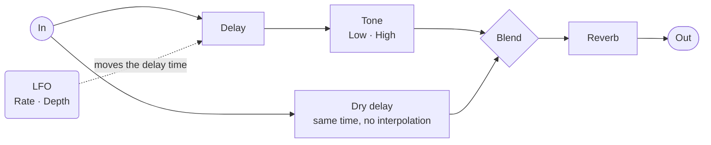

# The Lovers

Part of the Arcana series of patches for the Empress ZOIA.

An analog-style chorus and vibrato, modelled on the Walrus Audio Julianna. `Blend` walks
from dry, through chorus, to vibrato.

Two things the original does not have: a **reverb** after the effect, and **`Dyn`**, a
dynamic response where playing harder opens the effect depth — or closes it, with `Dyn`
turned the other way.

## Getting started

Mono → mono, mono → stereo, or stereo → stereo.

The first page is all knobs. Three of them get you a sound:

| Knob | Turn it |
| --- | --- |
| `Blend` | Fully left is dry, middle is chorus, fully right is vibrato |
| `Rate` | How fast the effect moves |
| `Depth` | How much it moves |

The lamps in the middle two columns light up as `Dyn` responds to your playing. They stay
dark when `Dyn` is at zero.

With every knob at zero the patch is a bypass: the dry runs through a delay of its own, so
it stays in step with the wet and nothing thins out.

The three footswitches each do two things:

| Footswitch | Short press | Long press |
| --- | --- | --- |
| **Left** | Tap tempo | Ramp to `Rate 2` — up or down — back on release |
| **Middle** | Reverb on / off | MIDI clock sync on / off |
| **Right** | Bypass | — |

Tap tempo and MIDI clock replace the `Rate` knob rather than adding to it. Moving `Rate`
cancels the tapped tempo and hands control back to the knob.

## Signal path

**The dry is delayed too.** It runs through its own delay line, set to the same base time
as the wet, with interpolation off so it never pitches. That is what makes every knob at
zero a true bypass: dry and wet stay in step, so nothing hollows out and nothing flanges.
The base delay is kept rather than zeroed — zeroing it is what turns a chorus into a
flanger.

## Front page

| Row | 1 | 2 | 3 | 4 | 5 | 6 | 7 | 8 |
| --- | --- | --- | --- | --- | --- | --- | --- | --- |
| **1** | | | `Low` | | | `High` | | |
| **2** | 1/4 | `R.Decay` | `R.Mix` | Env led | Env led | `Env. Fall` | `Env. Dyn` | Sine |
| **3** | 1/4 triplet | `R.Tone` | Rate led | `Rate` | `Rate 2` | Rate led | `Env Thresh` | Triangle |
| **4** | 1/8 | | `Drift` | Verb led | Verb led | `Lag` | | Random |
| **5** | Clock | | | `Depth` | `Blend DCV` | | | LFO |

Columns 1 and 8 are the two menus, closed until you press their launcher on row 5. The
lamps sit in the middle two columns, the knobs either side of them, grouped by colour.

### The lamps

| Lamp | Where | What it says |
| --- | --- | --- |
| Env led | row 2, middle | the envelope, as `Dyn` responds to your playing |
| Rate led | row 3, either side of `Rate` | which source owns the rate, pulsing with the LFO |
| Verb led | row 4, middle | the reverb is on |

The two **Rate leds** flank `Rate` and `Rate 2`, and they pulse in time with the
modulation, so you can see the shape and the speed before you hear them. Their colour is
the useful part:

| Colour | The rate comes from |
| --- | --- |
| Peach | the `Rate` knob |
| Aqua | tap tempo — the left switch |
| Magenta | MIDI clock |

### Aqua — the effect

| Knob | What it does |
| --- | --- |
| `Blend` | Dry → chorus → vibrato |
| `Rate` | LFO speed, 0.56 Hz to 9 Hz |
| `Depth` | How far the LFO moves the delay |
| `Lag` | The delay it moves around, 0.9 ms to 18 ms. Thin at the bottom, seasick at the top |
| `Rate 2` | Speed the LFO ramps to on a long left press |
| `Drift` | A slow wander that speeds the LFO up and slows it down |

### Purple — reverb

| Knob | What it does |
| --- | --- |
| `R.Mix` | How much |
| `R.Decay` | How long |
| `R.Tone` | How dark |

### Orange — dynamics

| Knob | What it does |
| --- | --- |
| `Env. Dyn` | How much your playing moves the effect depth. Centre is off, one way opens it, the other closes it |
| `Env Thresh` | How hard you have to play before it responds |
| `Env. Fall` | How quickly it closes again |

A green LED beside them lights as the envelope opens.

### Peach — tone

One tone control on the modulated voice, two ends, flat at the centre. It sits after the
delay, so it shapes how the wet sits against the dry and leaves the dry alone.

| Knob | What it does |
| --- | --- |
| `Low` | Bass in the modulated voice. Down keeps the low end out of the chorus |
| `High` | Treble in the modulated voice. Down sits it darker behind the dry |

### Menus

Two buttons on the bottom row open menus. `Clock` in yellow, bottom left, sets what one tap
is worth. `LFO` in aqua, bottom right, picks the modulation shape. Press one, its options
appear beside it, pick one and they hide again.

Double-press a launcher to go back to its default.

Both menus use the same three colours, in the same order:

| Colour | `LFO` | `Clock` |
| --- | --- | --- |
| Mango | Sine — **default** | 1/4 — **default** |
| Green | Triangle | 1/4 triplet |
| Blue | Random | 1/8 |

## MIDI

One decade per group, matching the colours on the front page. Values run `0` to `127`
across each knob's travel.

| Aqua — effect | | Purple — reverb | |
| --- | --- | --- | --- |
| 20 | `Rate` | 30 | `R.Decay` |
| 21 | `Rate 2` | 31 | `R.Tone` |
| 22 | `Depth` | 32 | `R.Mix` |
| 23 | `Lag` | | |
| 24 | `Drift` | | |
| 25 | `Blend DCV` | | |

| Orange — dynamics | | Peach — tone | |
| --- | --- | --- | --- |
| 40 | `Env. Dyn` | 50 | `Low` |
| 41 | `Env. Fall` | 51 | `High` |
| 42 | `Env Thresh` | | |

MIDI clock drives the LFO when sync is on — long press the middle switch.

## In stereo

`Blend` mixes dry and wet on the left channel only; the right always carries the modulated
signal. In mono you just hear the blend.

---

[SCHEMA.md](SCHEMA.md) documents the internals.
