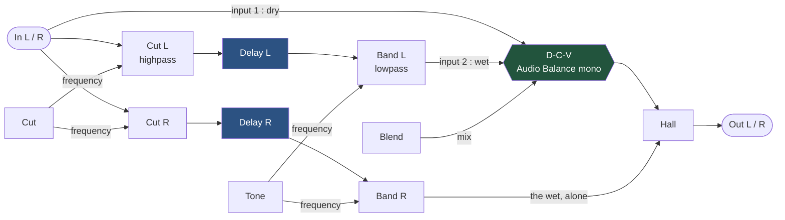
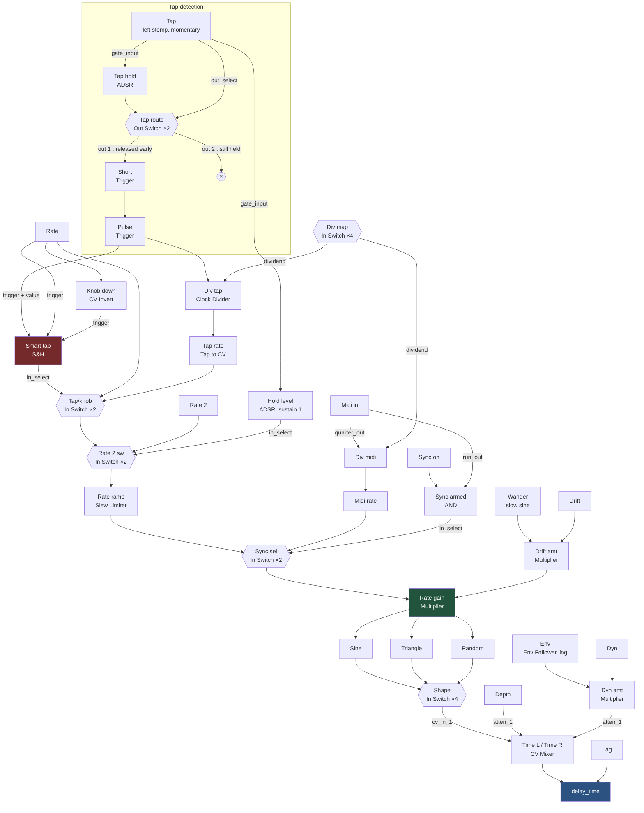

# The Lovers — internals

How the patch is wired. See [README.md](README.md) for playing it.

One short delay line whose time is moved about by an LFO, mixed back against the dry
signal. How much dry survives is what turns a chorus into a vibrato.

## Audio

The left output carries the `D-C-V` mix, the right output carries the wet alone. Both
sides modulate in phase. Downstream of the split both channels pass through one stereo
`Hall Reverb`, so the split is exact only with `R.Mix` at zero.

`Cut` is a highpass in front of each delay — detuned bass is what makes a chorus flabby,
and the dry path leaves the input *before* it, so the low end stays whole. `Band` is the
lowpass after. Each pair is driven from a single knob, so left and right cannot drift
apart; the filters' own `frequency` sits at zero and the knob carries the range.

## Control

### Rate

`Rate` and the tap contend; MIDI does not. `Smart tap` is a `Sample and Hold` whose
trigger *and* value are the tap pulse, so a tap latches 1. `Rate` triggers it too, and
`Knob down` — a `CV Invert` — catches the downward edge, so turning the knob either way
samples 0 and hands the rate back. Last touched wins. `track & hold` must stay **off**,
or holding the switch would follow the knob.

`Sync sel` is a plain switch downstream of everything, and `Sync armed` ANDs the toggle
with the clock's `run_out` — an unclocked `Tap to CV` sits at its rail and would pin
every LFO.

### Rate 2

An `In Switch` steps between its inputs and does not interpolate, so the ramp has to sit
*after* the switch. `Rate ramp` is a `Slew Limiter`, which limits the rate of change
rather than the time: a small turn of `Rate` still arrives promptly while the jump to
`Rate 2` glides.

### Drift

`Rate gain` multiplies the rate rather than adding to it, so the wander reads the same at
every speed. No `CV Mixer` builds the `1 + drift`: a param block sums its own knob with
whatever arrives by cable. That block is bounded at [0, 1] so it cannot be centred on 1.0
— the mean sits below and is paid back upstream, where a connection may exceed 100%.

### Depth and Dyn

Neither reaches `delay_time` directly. They meet on the CV mixer's attenuverter, so both
scale the LFO instead of shifting the base. `CV Input` on the delays is `exponent`, so a
fixed CV swing is a fixed *ratio* of time — `Depth` keeps its character wherever `Lag`
sits.

`interpolation` stays on. It is what stops the sweep clicking, and it is why square,
sawtooth and ramp are not offered as shapes: all three are discontinuous once per cycle,
and a step in `delay_time` is a click.

## Menus

Both menus work the same way. A `CV Flip Flop` holds open/closed and the launcher toggles
it. The options only respond while it is open: a `Multiplier` gates the picks, a
`Sample and Hold` stores the choice, an `In Switch` applies it. Pressing the launcher
while the menu is already open clears the hold instead, which is why a double press
returns to the default.

## Pages

| Page | Contents |
| --- | --- |
| 0 `The Lovers` | Every knob, the two menus, the envelope LED |
| 2 `Switches` | The three footswitches and their tap/hold split |
| 3 `Audio` | Input, filters, delays, `D-C-V`, output |
| 4 `Rate` | Knob vs tap arbitration, the ramp to `Rate 2` |
| 5 `Clock` | MIDI clock in, tap to CV, division, sync selection |
| 6 `Shape` | The LFOs and the switch that picks one |
| 7 `Time` | `Drift` and the two delay-time mixers |
| 8 `Reverb` | `Hall Reverb` |
| 9 `Menus` | Show/hide logic for the two menus |
| 10 `Params` | Envelope follower, threshold gate, rectifier |

## What has to be set by ear

`Cut` and `Tone`, the slew rate of the ramp to `Rate 2`, the `Dyn` amount, and the
envelope's rise and fall. None of them can be derived — they depend on the guitar and the
amp in front of them.
