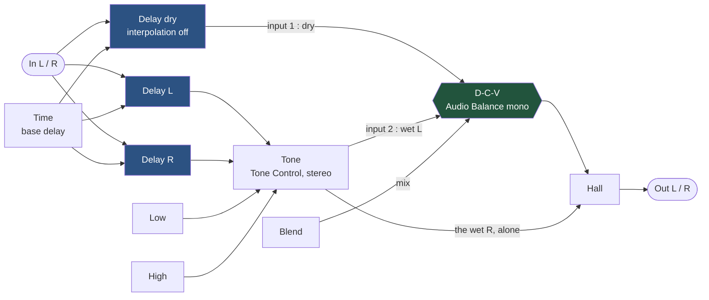
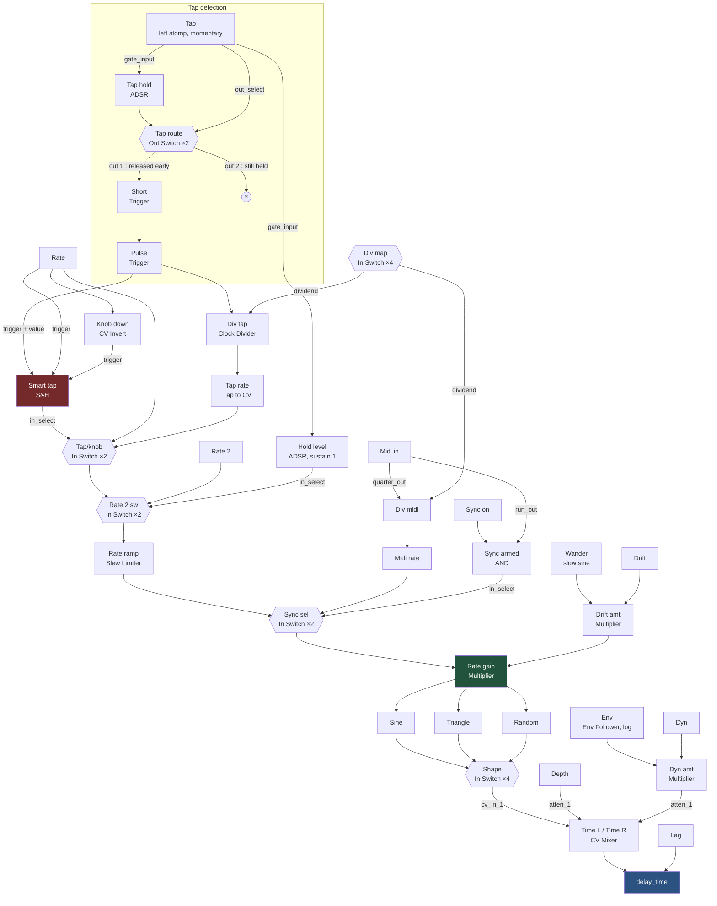

# The Lovers — internals

How the patch is wired. See [README.md](README.md) for playing it.

One short delay line whose time is moved about by an LFO, mixed back against the dry
signal. How much dry survives is what turns a chorus into a vibrato.

## Audio

The left output carries the `D-C-V` mix, the right output carries the wet alone. Both
sides modulate in phase. Downstream of the split both channels pass through one stereo
`Hall Reverb`, so the split is exact only with `R.Mix` at zero.

**The dry has a delay of its own.** `Delay dry` takes the same `Time` as the wet pair, so
the two arrive together and every knob at zero is a real bypass. Its `interpolation` is
**off**: the dry must not pitch when the time moves, and it never needs to — only the wet
is modulated. The base delay is kept rather than zeroed, because a chorus with no base
delay is a flanger.

`Low` and `High` are the two ends of one stereo `Tone Control` after the delays, flat at
the centre. One module for both channels, so left and right cannot drift apart, and the
dry never passes through it.

## Control

### Rate

`Rate` and the tap contend; MIDI does not. `Smart tap` is a `Sample and Hold` whose
trigger *and* value are the tap pulse, so a tap latches 1. `Rate` triggers it too, and
`Knob down` — a `CV Invert` — catches the downward edge, so turning the knob either way
samples 0 and hands the rate back. Last touched wins. `track & hold` must stay **off**,
or holding the switch would follow the knob.

`Sync sel` is a plain switch downstream of everything, and `Sync armed` ANDs the toggle
with the clock's `run_out` — an unclocked `Tap to CV` sits at its rail and would pin
every LFO.

### Rate 2

An `In Switch` steps between its inputs and does not interpolate, so the ramp has to sit
*after* the switch. `Rate ramp` is a `Slew Limiter`, which limits the rate of change
rather than the time: a small turn of `Rate` still arrives promptly while the jump to
`Rate 2` glides.

### Drift

`Rate gain` multiplies the rate rather than adding to it, so the wander reads the same at
every speed. No `CV Mixer` builds the `1 + drift`: a param block sums its own knob with
whatever arrives by cable. That block is bounded at [0, 1] so it cannot be centred on 1.0
— the mean sits below and is paid back upstream, where a connection may exceed 100%.

### Depth and Dyn

Neither reaches `delay_time` directly. They meet on the CV mixer's attenuverter, so both
scale the LFO instead of shifting the base. `CV Input` on the delays is `exponent`, so a
fixed CV swing is a fixed *ratio* of time — `Depth` keeps its character wherever `Lag`
sits.

`interpolation` stays on. It is what stops the sweep clicking, and it is why square,
sawtooth and ramp are not offered as shapes: all three are discontinuous once per cycle,
and a step in `delay_time` is a click.

## Menus

Both menus work the same way. A `CV Flip Flop` holds open/closed and the launcher toggles
it. The options only respond while it is open: a `Multiplier` gates the picks, a
`Sample and Hold` stores the choice, an `In Switch` applies it.

The pick is what writes the hold — `pick MUL` feeds both its value and its trigger — so
the launcher only ever opens and shuts. It used to clear the hold as well, through
`clear AND` = AND(open, launcher tap), which made a second press revert to the default.
That connection is gone, and the two `clear AND` gates went with it.

## Pages

| Page | Contents |
| --- | --- |
| 0 `The Lovers` | Every knob, the two menus, the lamps |
| 2 `Controls` | The flip flops the feet, the screen and MIDI all read |
| 3 `Switches` | The three footswitches, their tap/hold split, the bypass |
| 4 `Audio` | Input, the three delay lines, `Tone`, `D-C-V`, `Hall`, output |
| 5 `Rate` | Knob vs tap arbitration, and the ramp to `Rate 2` |
| 6 `Clock` | MIDI clock in, tap to CV, division, sync selection |
| 7 `Clock Menu` | Show/hide and pick, for the clock division |
| 8 `LFO` | The sine and the triangle, and the switch that picks a shape |
| 9 `LFO Random` | The random shape, slewed so it cannot step |
| 10 `Shape Menu` | Show/hide and pick, for the LFO shape |
| 11 `Drift` | The slow wander and how much of it applies |
| 12 `Time` | The two delay-time mixers and the base `Time` |
| 13 `Envelope` | Envelope follower, threshold gate, rectifier |
| 14 `Values` | The colour constants the lamps and menus share |
| 15 `Reverb MIDI` | The reverb's toggle and its force pair |

## What has to be set by ear

`Low` and `High`, the slew rate of the ramp to `Rate 2`, the `Dyn` amount, and the
envelope's rise and fall. None of them can be derived — they depend on the guitar and the
amp in front of them.
