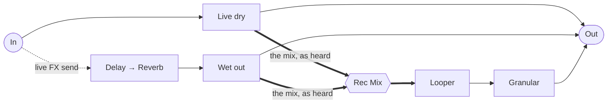
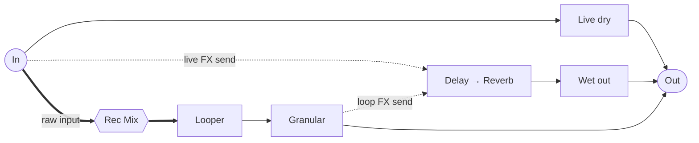

# The Magician — signal path

Both diagrams show the same patch. What changes between them is `L.Loop FX`, which
picks the loop's routing *and* what the looper records.

## Loop FX OFF — the loop plays dry, and records the mix



The looper takes what reaches the output: the live dry and the wet, already
balanced by `Live Send FX`. The loop is not re-sent to the effects on playback, so
the effect you performed is frozen into the recording — and the granular then
works on that.

## Loop FX ON — the loop is sent to the effects, and records dry



The loop now feeds the effects at playback, so recording it wet would stack two
generations of delay and reverb. `Rec Mix` takes the raw input instead, and the
granular sits before the effects rather than after them.

## Rec Mix

One `Audio Balance`, with `L.Loop FX` driving its `mix` directly — no level to
compute:

```
L.Loop FX = 0  ->  input 1 : live dry + wet, the output mix
L.Loop FX = 1  ->  input 2 : the raw input, at full
```

Because a flip-flop drives it, the crossfader never sits between the two
positions, so the input never reaches the looper by both paths at once.

## The two sends and their complements

Each source crossfades between going straight out and going to the shared
effects, so nothing is counted twice:

```
live :  Live dry = In × (1 − live send)      Dry send  = In × live send
loop :  Loop dry = Loop × (1 − loop send)    Loop send = Loop × loop send
```

The loop's pair is gated by `L.Loop FX` too: with it off the loop goes out dry and
sends nothing, so `Loop Send FX` only bites once the loop is routed to the
effects.
