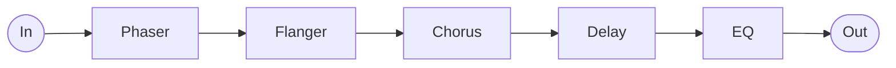

# The World

Part of the Arcana series of patches for the Empress ZOIA.

A pedalboard in one patch: phaser, flanger, chorus, tape delay and a three-band EQ, in
series. Each one is switched by foot, by the screen, or over MIDI, and the three always
agree.

## Getting started

Mono or stereo in, mono or stereo out. One cable is enough at either end — the pedal
copies a single input to both sides, and nothing here is panned, so a single output
carries the whole effect and only the stereo width goes.

The front page is a grid: one column per effect, its knobs above, its on/off button on the
bottom row. The last two columns are the input meters.

| Row | Phaser | Flanger | Chorus | Delay | EQ | | meter L | meter R |
| --- | --- | --- | --- | --- | --- | --- | --- | --- |
| **1** | Rate | Rate | Rate | Time | Low | | L5 | R5 |
| **2** | Resonance | Regen | Width | Feedback | Mid | | L4 | R4 |
| **3** | Width | Width | Tone | Modulation | Mid freq | | L3 | R3 |
| **4** | | Tone | Mix | Mix | High | | L2 | R2 |
| **5** | on/off | on/off | on/off | on/off | on/off | | L1 | R1 |

The delay's Modulation is the wow and flutter on the tape.

The three footswitches each do two things, except the right one:

| Footswitch | Short press | Long press |
| --- | --- | --- |
| **Left** | Phaser | Flanger |
| **Middle** | Chorus | Delay |
| **Right** | EQ | — |

That mapping is easy to change. Page 2 has one trigger per press — left, middle and right,
short and long — each wired to the effect it switches. Move a wire and the footswitch does
something else.

The top segments of the meters are red — back off before you reach them.

## Signal path

Fixed order, modulations first and tone last. The EQ is switched in and out at its own
input rather than being taken out of the chain. The reverb lives outside the patch,
downstream.

## MIDI

Every knob is mapped, one decade per effect:

| | Knobs | Toggle | Force on | Force off |
| --- | --- | --- | --- | --- |
| Phaser | 20–22 | 25 | 26 | 27 |
| Flanger | 30–33 | 35 | 36 | 37 |
| Chorus | 40–43 | 45 | 46 | 47 |
| Delay | 50–53 | 55 | 56 | 57 |
| EQ | 70–73 | 75 | — | — |

**Toggle** flips whatever the state is, like a footswitch. **Force** puts an effect in a
known state and leaves it there if it is already — useful at the top of a song, when you
cannot see the board. The EQ has no force pair: its toggle is for hearing it in and out
while you set it up, not for switching it off in use.

Any value above 0 fires a CC.

---

[SCHEMA.md](SCHEMA.md) documents the internals.
