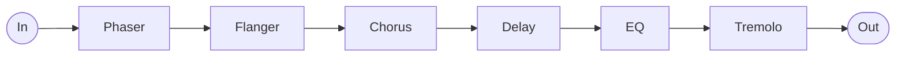

# The World

Part of the Arcana series of patches for the Empress ZOIA.

A pedalboard in one patch: phaser, flanger, chorus, tape delay, tremolo and a three-band
EQ, in series. Each one is switched by foot, by the screen, or over MIDI, and the three
always agree.

## Getting started

Stereo in, stereo out. Mono works on either side.

The front page is a grid: one column per effect, its knobs above, its on/off button on the
bottom row.

| Row | Phaser | Flanger | Chorus | Delay | Tremolo | EQ | | |
| --- | --- | --- | --- | --- | --- | --- | --- | --- |
| **1** | Rate | Rate | Rate | Time | Rate | Low | meter L | meter R |
| **2** | Resonance | Feedback | Width | Feedback | Depth | Mid | meter L | meter R |
| **3** | Width | Width | Tone | Modulation | | Mid freq | meter L | meter R |
| **4** | | Tone | Mix | Mix | | High | meter L | meter R |
| **5** | on/off | on/off | on/off | on/off | on/off | on/off | meter L | meter R |

The delay's Modulation is the wow and flutter on the tape.

Press a button and it lights up. The patch starts with chorus, delay and EQ on, phaser,
flanger and tremolo off.

The three footswitches each do two things:

| Footswitch | Short press | Long press |
| --- | --- | --- |
| **Left** | Phaser | Flanger |
| **Middle** | Chorus | Delay |
| **Right** | Tremolo | EQ |

That mapping is easy to change. Page 2 has one trigger per press — left, middle and right,
short and long — each wired to the effect it switches. Move a wire and the footswitch does
something else.

The top segments of the meters are red — back off before you reach them.

## Signal path

Fixed order, modulations first and tone last. The reverb lives outside the patch,
downstream.

## MIDI

One decade per effect, one unit digit per action.

| | Toggle | Force on | Force off |
| --- | --- | --- | --- |
| Phaser | 25 | 26 | 27 |
| Flanger | 35 | 36 | 37 |
| Chorus | 45 | 46 | 47 |
| Delay | 55 | 56 | 57 |
| Tremolo | 65 | 66 | 67 |
| EQ | 75 | — | — |

**Toggle** flips whatever the state is, like a footswitch. **Force** puts an effect in a
known state and leaves it there if it is already — useful at the top of a song, when you
cannot see the board.

Any value above 0 fires a CC. The knobs are not mapped.

---

[SCHEMA.md](SCHEMA.md) documents the internals.
